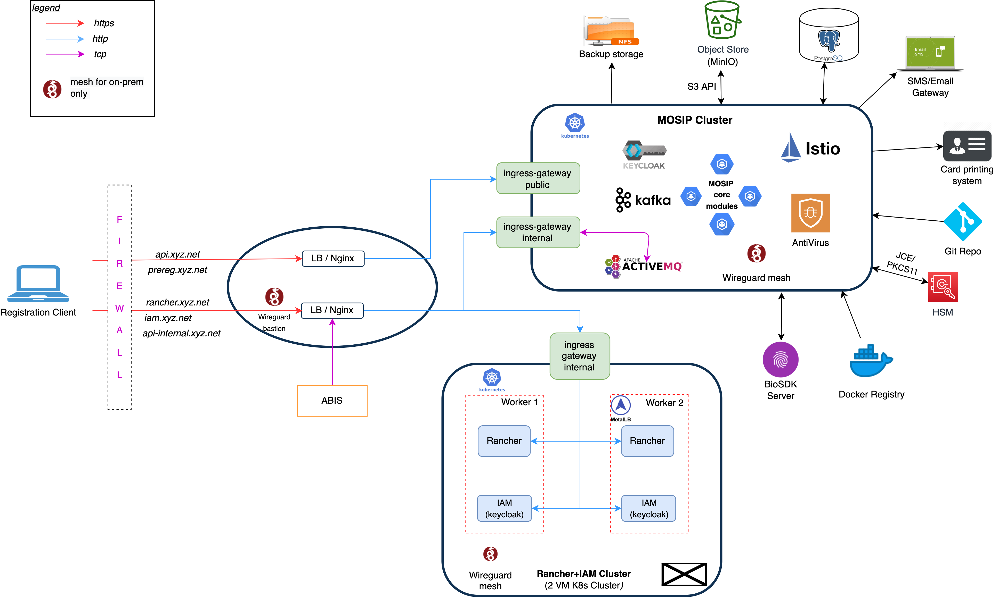

# On-prem Cluster Setup

## Overview
This is a guide to set up on-prem Kubernetes cluster that will host all the MOSIP modules.



## Prerequisites
- [Hardware, network, certificate requirements](./requirements.md).
- [Rancher](../../rancher).
- Command line utilities:
  - `kubectl`
  - `helm`
  - `rke`
  - `istioctl`
- Helm repos:
  ```sh
  helm repo add bitnami https://charts.bitnami.com/bitnami
  helm repo add mosip https://mosip.github.io/mosip-helm
  ```

## Cluster setup
* Set up VMs.
* Create Kubernetes cluster as given in [RKE Cluster Creation](../../docs/rke-setup.md) document.

## Istio for service discovery and ingress
* Navigate to [istio](./istio/) folder in this directory.
* Edit the `install.sh` and `iop.yaml` accordingly and install it.
  ```
  export KUBECONFIG="$HOME/.kube/mosip_cluster.config"
  ./install.sh
  ```
* This will bring up all Istio components and the Ingress Gateways.
* Check Ingress Gateway services using;
  ```
  kubectl get svc -n istio-system
  ```

## Global configmap
* `cd ../`
* Copy `global_configmap.yaml.sample` to `global_configmap.yaml`
* Update the domain names in `global_configmap.yaml` and run
```sh
kubectl apply -f global_configmap.yaml
```

## Nginx + Wireguard 
* Install [Nginx Reverse Proxy](./nginx/) on a seperate machine/VM, that proxies traffic to the above Ingress Gateways.

## DNS mapping
* Point your domain names to respective public IP or internal IP of the Nginx node. Refer to the [DNS Requirements](./requirements.md#DNS_requirements) document and your `global_configmap.yaml` to correlate the mappings.

## Httpbin
* Install [`httpbin`](../../utils/httpbin/README.md) for testing the wiring.

## Register the cluster with Rancher
Add the newly created cluster to [Rancher Management Server](../../rancher/README.md) as given [here](https://rancher.com/docs/rancher/v2.6/en/cluster-provisioning/registered-clusters/).
* Add members, atleast one as Owner.

## Longhorn
* Install [Longhorn](../longhorn/README.md) for persistent storage.
